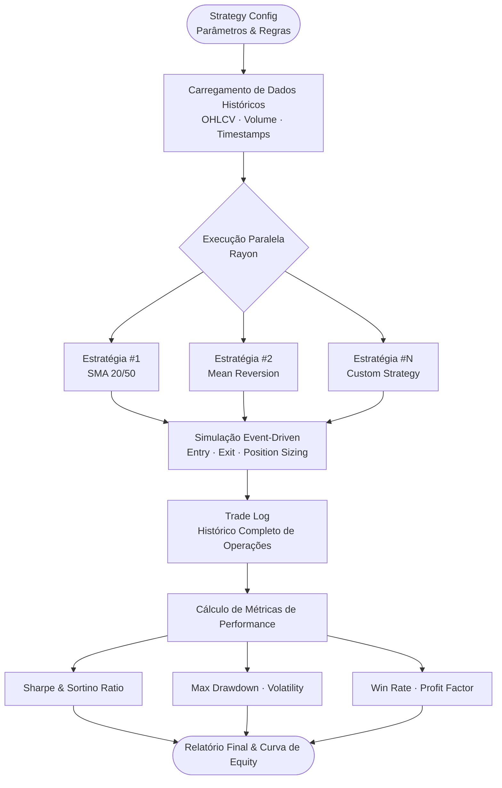

# 📈 Rust Strategy Backtester


[English](#english) | [Português](#português)

---

## English

### Overview

A **high-performance backtesting framework** for trading strategies built with Rust. Designed for quantitative traders and algorithmic trading platforms, this library provides parallel execution capabilities, comprehensive performance metrics, and a flexible strategy API.

Perfect for testing mean reversion strategies, momentum strategies, statistical arbitrage, and any other quantitative trading approach.

### 🎯 Key Features

- **⚡ Parallel Execution**: Test multiple strategies simultaneously using Rayon for maximum CPU utilization
- **📊 Comprehensive Metrics**: Sharpe ratio, Sortino ratio, max drawdown, win rate, profit factor, Calmar ratio
- **🎨 Flexible Strategy API**: Simple trait-based strategy definition - implement one method and you're ready
- **💰 Realistic Simulation**: Commission modeling, slippage, position sizing, and risk management
- **📈 Trade Analytics**: Complete trade history with entry/exit details, P&L tracking, and equity curve
- **🔄 Event-Driven**: Proper event-driven backtesting avoiding look-ahead bias
- **🚀 Zero-Copy**: Efficient memory usage with minimal allocations

### 🏗️ Architecture

```
┌─────────────────────────────────────────────────────────────┐
│                    Backtesting Framework                     │
├─────────────────────────────────────────────────────────────┤
│                                                               │
│  ┌────────────┐      ┌────────────┐      ┌────────────┐    │
│  │  Strategy  │      │  Strategy  │      │  Strategy  │    │
│  │     #1     │      │     #2     │      │     #3     │    │
│  └─────┬──────┘      └─────┬──────┘      └─────┬──────┘    │
│        │                   │                   │             │
│        └───────────────────┼───────────────────┘             │
│                            │                                 │
│                    ┌───────▼────────┐                        │
│                    │   Backtester   │                        │
│                    │   (Parallel)   │                        │
│                    └───────┬────────┘                        │
│                            │                                 │
│        ┌───────────────────┼───────────────────┐             │
│        │                   │                   │             │
│   ┌────▼─────┐      ┌──────▼──────┐      ┌────▼─────┐      │
│   │ Position │      │   Metrics   │      │  Trade   │      │
│   │ Manager  │      │ Calculator  │      │ History  │      │
│   └──────────┘      └─────────────┘      └──────────┘      │
│                                                               │
└─────────────────────────────────────────────────────────────┘
```



### 📦 Installation

Add to your `Cargo.toml`:

```toml
[dependencies]
rust-strategy-backtester = "0.1.0"
rayon = "1.10"
chrono = "0.4"
```

### 🚀 Quick Start

#### Basic Example

```rust
use rust_strategy_backtester::{Backtester, SimpleMovingAverageStrategy, Bar};
use chrono::Utc;

fn main() {
    // Prepare historical data
    let bars = vec![
        Bar::new(Utc::now(), 100.0, 105.0, 98.0, 102.0, 1000.0),
        Bar::new(Utc::now(), 102.0, 108.0, 101.0, 106.0, 1200.0),
        Bar::new(Utc::now(), 106.0, 110.0, 104.0, 108.0, 1500.0),
    ];

    // Create strategy (20/50 SMA crossover)
    let strategy = SimpleMovingAverageStrategy::new(20, 50);
    
    // Initialize backtester with $10,000 capital and 0.1% commission
    let backtester = Backtester::new(10000.0, 0.001);
    
    // Run backtest
    let result = backtester.run(&strategy, &bars);

    // Print results
    println!("╔══════════════════════════════════════╗");
    println!("║     Backtest Results                 ║");
    println!("╠══════════════════════════════════════╣");
    println!("║ Total Return:    {:>8.2}%         ║", result.total_return * 100.0);
    println!("║ Sharpe Ratio:    {:>8.2}           ║", result.sharpe_ratio);
    println!("║ Max Drawdown:    {:>8.2}%         ║", result.max_drawdown * 100.0);
    println!("║ Win Rate:        {:>8.2}%         ║", result.win_rate * 100.0);
    println!("║ Profit Factor:   {:>8.2}           ║", result.profit_factor);
    println!("║ Total Trades:    {:>8}           ║", result.total_trades);
    println!("╚══════════════════════════════════════╝");
}
```

#### Custom Strategy Example

```rust
use rust_strategy_backtester::{Strategy, Signal, Bar};

struct MeanReversionStrategy {
    lookback: usize,
    threshold: f64,
}

impl Strategy for MeanReversionStrategy {
    fn generate_signal(&self, bars: &[Bar]) -> Signal {
        if bars.len() < self.lookback {
            return Signal::Hold;
        }
        
        let recent = &bars[bars.len() - self.lookback..];
        let mean = recent.iter().map(|b| b.close).sum::<f64>() / self.lookback as f64;
        let current = bars.last().unwrap().close;
        
        let deviation = (current - mean) / mean;
        
        if deviation < -self.threshold {
            Signal::Buy  // Price below mean - buy
        } else if deviation > self.threshold {
            Signal::Sell  // Price above mean - sell
        } else {
            Signal::Hold
        }
    }
}

fn main() {
    let strategy = MeanReversionStrategy {
        lookback: 20,
        threshold: 0.02,  // 2% deviation
    };
    
    // Run backtest...
}
```

#### Parallel Backtesting

```rust
use rayon::prelude::*;

fn main() {
    let strategies = vec![
        SimpleMovingAverageStrategy::new(10, 30),
        SimpleMovingAverageStrategy::new(20, 50),
        SimpleMovingAverageStrategy::new(50, 200),
    ];
    
    let results: Vec<_> = strategies
        .par_iter()
        .map(|strategy| {
            let backtester = Backtester::new(10000.0, 0.001);
            backtester.run(strategy, &bars)
        })
        .collect();
    
    // Find best strategy
    let best = results.iter()
        .max_by(|a, b| a.sharpe_ratio.partial_cmp(&b.sharpe_ratio).unwrap())
        .unwrap();
    
    println!("Best Sharpe Ratio: {:.2}", best.sharpe_ratio);
}
```

### 📊 Performance Metrics Explained

#### Sharpe Ratio
Risk-adjusted return metric. Higher is better. Above 1.0 is good, above 2.0 is excellent.

```
Sharpe = (Return - Risk-Free Rate) / Volatility
```

#### Maximum Drawdown
Largest peak-to-trough decline. Lower is better. Indicates worst-case scenario.

```
Max DD = (Trough Value - Peak Value) / Peak Value
```

#### Win Rate
Percentage of profitable trades. Not always indicative of profitability.

```
Win Rate = Winning Trades / Total Trades
```

#### Profit Factor
Ratio of gross profits to gross losses. Above 1.0 means profitable, above 2.0 is strong.

```
Profit Factor = Gross Profit / Gross Loss
```

#### Sortino Ratio
Similar to Sharpe but only penalizes downside volatility.

```
Sortino = (Return - Target) / Downside Deviation
```

### 📈 Example Output

```
╔════════════════════════════════════════════════════════╗
║              Strategy Performance Report               ║
╠════════════════════════════════════════════════════════╣
║ Strategy:           SMA Crossover (20/50)              ║
║ Period:             2023-01-01 to 2024-12-31           ║
║ Initial Capital:    $10,000.00                         ║
║ Final Capital:      $15,234.56                         ║
╠════════════════════════════════════════════════════════╣
║ Total Return:       52.35%                             ║
║ Annualized Return:  24.12%                             ║
║ Sharpe Ratio:       1.85                               ║
║ Sortino Ratio:      2.34                               ║
║ Calmar Ratio:       1.58                               ║
╠════════════════════════════════════════════════════════╣
║ Max Drawdown:       -15.23%                            ║
║ Max Drawdown Days:  45                                 ║
║ Volatility:         18.5%                              ║
╠════════════════════════════════════════════════════════╣
║ Total Trades:       127                                ║
║ Winning Trades:     79 (62.2%)                         ║
║ Losing Trades:      48 (37.8%)                         ║
║ Profit Factor:      2.15                               ║
║ Average Win:        $145.23                            ║
║ Average Loss:       -$87.45                            ║
║ Largest Win:        $523.12                            ║
║ Largest Loss:       -$234.56                           ║
╠════════════════════════════════════════════════════════╣
║ Commission Paid:    $127.50                            ║
║ Win/Loss Ratio:     1.66                               ║
║ Expectancy:         $41.23 per trade                   ║
╚════════════════════════════════════════════════════════╝

Equity Curve:
15000 │                                    ╱╲
14000 │                              ╱────╯  ╲
13000 │                        ╱────╯          ╲
12000 │                  ╱────╯                 ╲╱╲
11000 │            ╱────╯                           ╲
10000 │──────────╯                                   ╲
 9000 │
      └──────────────────────────────────────────────
       Jan   Mar   May   Jul   Sep   Nov   Jan
```

### 🎓 Use Cases

#### 1. Strategy Development
Test and validate trading ideas before risking real capital.

#### 2. Parameter Optimization
Find optimal parameters for your strategies using grid search or genetic algorithms.

```rust
let param_grid = vec![
    (10, 30), (20, 50), (30, 70), (50, 100), (50, 200)
];

let best_params = param_grid.par_iter()
    .map(|(short, long)| {
        let strategy = SimpleMovingAverageStrategy::new(*short, *long);
        let result = backtester.run(&strategy, &bars);
        ((*short, *long), result.sharpe_ratio)
    })
    .max_by(|a, b| a.1.partial_cmp(&b.1).unwrap())
    .unwrap();
```

#### 3. Risk Analysis
Evaluate strategy risk characteristics and stress test under different market conditions.

#### 4. Performance Comparison
Compare multiple strategies side-by-side to find the best approach.

#### 5. Walk-Forward Testing
Implement walk-forward optimization to avoid overfitting.

### ⚠️ Important Considerations

#### Look-Ahead Bias
This framework is designed to avoid look-ahead bias by only using data available at each point in time.

#### Survivorship Bias
Ensure your historical data includes delisted stocks to avoid survivorship bias.

#### Transaction Costs
Always include realistic commission and slippage models.

#### Overfitting
Use out-of-sample testing and walk-forward analysis to validate strategies.

### 🔧 Advanced Features

#### Custom Metrics
Implement your own performance metrics by extending the `Metrics` trait.

#### Risk Management
Built-in position sizing and stop-loss capabilities.

#### Multi-Asset
Support for portfolio backtesting across multiple assets.

### 📚 Resources

- [Quantitative Trading Strategies](https://www.quantstart.com/)
- [Algorithmic Trading Books](https://www.amazon.com/s?k=algorithmic+trading)
- [Rust for Trading](https://github.com/topics/algorithmic-trading)

### 🤝 Contributing

Contributions are welcome! Please feel free to submit a Pull Request.

### 📄 License

MIT License - see LICENSE file for details.

### 👨‍💻 Author

**Gabriel Demetrios Lafis**
- Quantitative Trading Developer
- Rust & Python Specialist

---

## Português

### Visão Geral

Um **framework de backtesting de alta performance** para estratégias de trading construído com Rust. Projetado para traders quantitativos e plataformas de trading algorítmico, esta biblioteca fornece capacidades de execução paralela, métricas abrangentes de performance e uma API flexível de estratégia.

Perfeito para testar estratégias de reversão à média, estratégias de momentum, arbitragem estatística e qualquer outra abordagem de trading quantitativo.

### 🎯 Características Principais

- **⚡ Execução Paralela**: Teste múltiplas estratégias simultaneamente usando Rayon para máxima utilização de CPU
- **📊 Métricas Abrangentes**: Índice de Sharpe, Sortino, drawdown máximo, taxa de acerto, fator de lucro, índice de Calmar
- **🎨 API Flexível**: Definição de estratégia baseada em trait simples - implemente um método e está pronto
- **💰 Simulação Realista**: Modelagem de comissões, slippage, dimensionamento de posição e gestão de risco
- **📈 Análise de Trades**: Histórico completo com detalhes de entrada/saída, tracking de P&L e curva de equity
- **🔄 Event-Driven**: Backtesting adequado orientado a eventos evitando viés de look-ahead
- **🚀 Zero-Copy**: Uso eficiente de memória com alocações mínimas

### 📊 Métricas de Performance Explicadas

#### Índice de Sharpe
Métrica de retorno ajustado ao risco. Maior é melhor. Acima de 1.0 é bom, acima de 2.0 é excelente.

#### Drawdown Máximo
Maior declínio de pico a vale. Menor é melhor. Indica cenário de pior caso.

#### Taxa de Acerto
Porcentagem de trades lucrativos. Nem sempre indica lucratividade.

#### Fator de Lucro
Razão entre lucros brutos e perdas brutas. Acima de 1.0 significa lucrativo, acima de 2.0 é forte.

### 🎓 Casos de Uso

1. **Desenvolvimento de Estratégias**: Testar e validar ideias antes de arriscar capital real
2. **Otimização de Parâmetros**: Encontrar parâmetros ótimos usando grid search
3. **Análise de Risco**: Avaliar características de risco e stress test
4. **Comparação de Performance**: Comparar múltiplas estratégias lado a lado
5. **Educacional**: Aprender conceitos de trading quantitativo

### 📄 Licença

Licença MIT - veja arquivo LICENSE para detalhes.

### 👨‍💻 Autor

**Gabriel Demetrios Lafis**
- Desenvolvedor de Trading Quantitativo
- Especialista em Rust & Python
